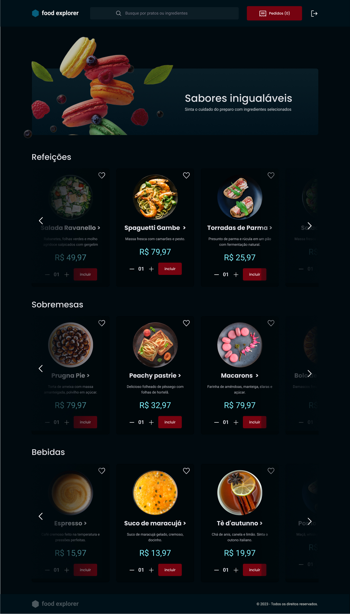

<h1 align="center" style="text-align: center;">
  
  Food Explorer
</h1>


<p align="center">
  <a href="#project">Projeto</a>&nbsp;&nbsp;&nbsp;|&nbsp;&nbsp;&nbsp;
  <a href="#pages">Páginas</a>&nbsp;&nbsp;&nbsp;|&nbsp;&nbsp;&nbsp;
  <a href="#features">Funcionalidades</a>&nbsp;&nbsp;&nbsp;|&nbsp;&nbsp;&nbsp;
  <a href="#technologies">Tecnologias</a>&nbsp;&nbsp;&nbsp;|&nbsp;&nbsp;&nbsp;
  <a href="#usage">Utilização</a>&nbsp;&nbsp;&nbsp;|&nbsp;&nbsp;&nbsp;
  <a href="#users">Personas</a>&nbsp;&nbsp;&nbsp;|&nbsp;&nbsp;&nbsp;
  <a href="#consideration">Considerações Finais</a>&nbsp;&nbsp;&nbsp;|&nbsp;&nbsp;&nbsp;
  <a href="#license">Licença</a>
</p>

<p align="center">
  
</p>

<h2 id="project">📁 Projeto</h2>

O projeto Food Explorer é o desafio final do programa Explorer da Rocketseat. Trata-se de uma aplicação de cardápio digital para um restaurante.

<h2 id="pages">📃 Páginas</h2>

A aplicação conta com as seguintes páginas:

- Login
- Cadastro
- Home
- Detalhes do prato
- Novo prato
- Editar prato



<h2 id="features">🛠️ Funcionalidades</h2>

A aplicação apresenta as seguintes funcionalidades:

- Login
- Cadastro
- Cadastrar pratos
- Mostrar pratos cadastrados
- Filtrar pratos
- Mostrar detalhes do prato
- Editar prato
- Excluir prato
- Logout

<h2 id="technologies">💻 Tecnologias</h2>

Este projeto foi desenvolvido com as seguintes tecnologias:

- Axios
- ReactJS
- ReactDOM
- React Icons
- React Responsive
- React Router Dom
- Styled Components
- Swiper
- ViteJS

<h2 id="usage">💡 Utilização</h2>

A aplicação Food Explorer está disponível para uso [aqui](https://foodexplorerdai.netlify.app).

Você também pode executá-la em sua máquina localmente. Certifique-se de ter o ``Node.js`` e o ``npm`` instalados antes de prosseguir com as etapas abaixo:

1. Clone o projeto:

```
$ git clone https://github.com/daiaanebarbosaf/foodexplorer
```

2. Acesse a pasta do projeto:

```
$ cd foodexplorer
```

3. Instale as dependências:

```
$ npm install
```

4. Inicie o servidor:

```
$ npm run dev
```

⚠️ **Importante**: Este projeto utiliza uma hospedagem gratuita para o back-end, portanto, pode haver atrasos no tempo de resposta do servidor.

<h2 id="users">👩🏾‍💻 Personas</h2>

O Food Explorer possui duas personas principais: o admin e o usuário comum. Você pode criar um novo usuário ou testar a aplicação usando os usuários já cadastrados:

Admin:

- E-mail: administrator@email.com
- Senha:  123456

O admin tem acesso privilegiado e pode gerenciar o cardápio, adicionando, editando e removendo pratos, além de executar outras tarefas administrativas.

Usuário:

- E-mail: user@email.com
- Senha: 123456

O usuário tem acesso restrito às funcionalidades da aplicação, podendo visualizar o cardápio, filtrar pratos, ver detalhes de pratos específicos, favoritar pratos e adicionar pratos ao carrinho.

<h2 id="#consideration">Considerações Finais</h2>
Com imensa satisfação, compartilho com você o meu primeiro projeto Full Stack em JavaScript, utilizando as tecnologias React e Node!<br>
Esta jornada foi extremamente desafiadora, proporcionando um aprendizado que vai além do que qualquer linguagem pode traduzir.<br> 
Espero que aprecie o que foi desenvolvido aqui.<br>
Estou aberta a sugestões e feedbacks, pois a verdadeira beleza está na constante evolução!

<h2 id="license">📝 Licença</h2>

Este projeto está sob a licença MIT.

---


<div style="display: flex;">
  <a href="https://www.linkedin.com/in/daiaanebarbosaf/" target="_blank">
  </a>
  <a href="mailto:daiaanebarbosaf@gmail.com">
  
  </a>
  <a href="https://discord.com/users/daiaanebarbosaf#9926" target="_blank">
  </a>
</div>
